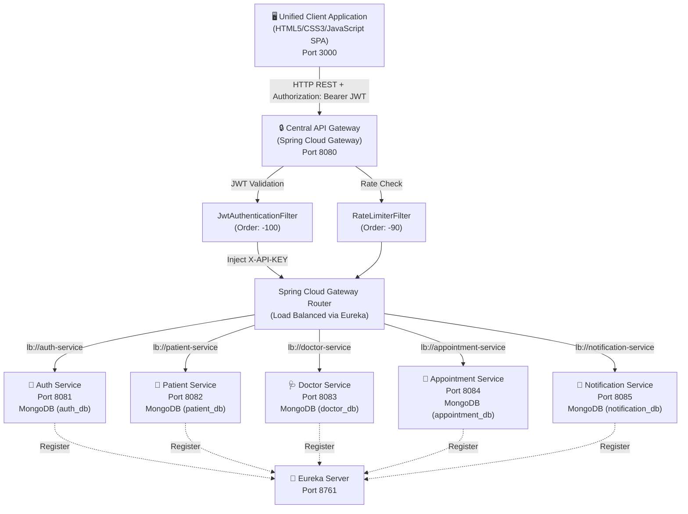
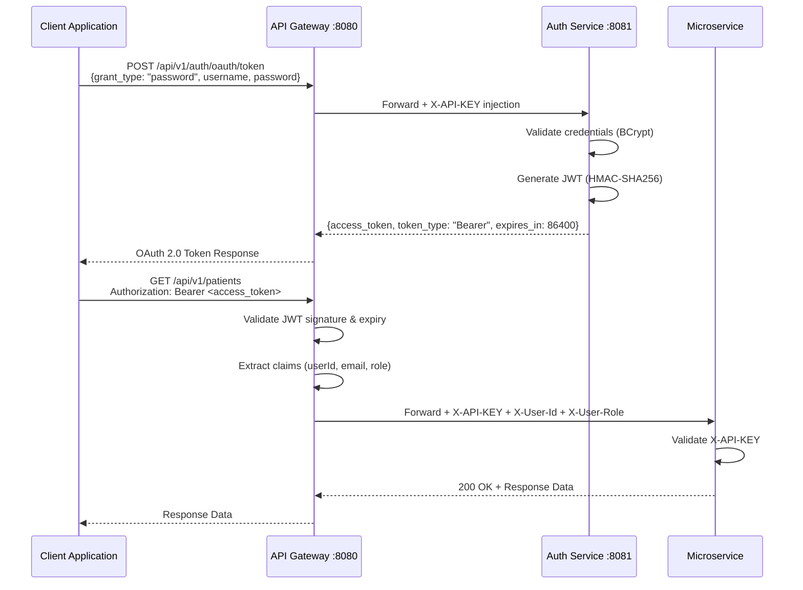

# Coursework Technical Report: Microservices-Based System Architecture
**Module**: Service-Oriented Computing  
**Project Title**: End-to-End Distributed Hospital Appointment Management System  
**Assessment Type**: Group Project (5 Students)  
**Deliverable**: GitHub Repository & Project Report  

---

## Executive Summary
This report presents the complete architectural design, security implementation, inter-service communication patterns, containerization strategy, and client integration for a distributed Hospital Appointment Management System. The platform is built using **Spring Boot 3.2.3 (Java 21)**, **Spring Cloud Gateway**, **Netflix Eureka**, **MongoDB**, and **Docker**, implementing a zero-trust microservices architecture with OAuth 2.0/JWT-secured API Gateway access and individual API Key enforcement across all downstream services.

---

## 1. System Architecture & Design

### 1.1 High-Level Architecture Diagram



### 1.2 Inter-Service Communication Flow

All client-to-service communication follows a strict gateway-mediated pattern:

1. **Client Request**: The SPA issues an HTTP request to `http://localhost:8080/api/v1/...` with an `Authorization: Bearer <JWT>` header.
2. **Gateway JWT Validation**: The `JwtAuthenticationFilter` (Global Filter, Order -100) intercepts the request:
   - Validates the JWT signature using HMAC-SHA256.
   - Checks token expiration.
   - Extracts user claims (`userId`, `email`, `role`).
   - Injects downstream headers: `X-User-Id`, `X-User-Email`, `X-User-Role`.
3. **Rate Limiting Check**: The `RateLimiterFilter` (Global Filter, Order -90) enforces IP-based throttling (100 requests/minute).
4. **Internal API Key Injection**: The Gateway automatically attaches `X-API-KEY: hospital-internal-secret-key-2026` to every forwarded request.
5. **Service Resolution**: Spring Cloud Gateway resolves the target microservice via Eureka load balancing (`lb://service-name`).
6. **Microservice API Key Validation**: The target microservice's `ApiKeyAuthenticationFilter` verifies the `X-API-KEY` header, rejecting any direct external calls that bypass the Gateway.
7. **Response**: The microservice processes the business logic and returns the response through the Gateway to the client.

### 1.3 Gateway Route Configuration

| Route Pattern | Target Service | Load Balanced URI |
|---|---|---|
| `/api/v1/auth/**` | Auth Service | `lb://auth-service` |
| `/api/v1/patients/**` | Patient Service | `lb://patient-service` |
| `/api/v1/doctors/**` | Doctor Service | `lb://doctor-service` |
| `/api/v1/appointments/**` | Appointment Service | `lb://appointment-service` |
| `/api/v1/notifications/**` | Notification Service | `lb://notification-service` |

---

## 2. Microservice Breakdown

### 2.1 Auth Service (Student 1 — Gateway Lead)

**Technology Stack**: Spring Boot 3.2.3, Spring Data MongoDB, Spring Security 6, JJWT 0.12.5, BCrypt Password Encoder, Springdoc OpenAPI 2.3.0.

**Database**: MongoDB (`auth_db`, collection: `users`)

#### Endpoints

| Method | Endpoint | Description | Auth |
|---|---|---|---|
| `POST` | `/api/v1/auth/register` | Register new user account | Public |
| `POST` | `/api/v1/auth/login` | Authenticate and issue JWT | Public |
| `POST` | `/api/v1/auth/oauth/token` | OAuth 2.0 ROPC token endpoint | Public |
| `GET` | `/api/v1/auth/validate?token=` | Validate JWT signature/expiry | Public |
| `GET` | `/api/v1/auth/user/{id}` | Get user profile by ID | Secured |

#### Request/Response Models

**Register Request:**
```json
{
  "name": "Dr. Sarah Connor",
  "email": "sarah.connor@hospital.com",
  "password": "securePassword123",
  "phone": "+94771234567",
  "role": "DOCTOR"
}
```

**Login Request:**
```json
{
  "email": "sarah.connor@hospital.com",
  "password": "securePassword123"
}
```

**OAuth 2.0 Token Request (ROPC Grant):**
```json
{
  "grant_type": "password",
  "username": "sarah.connor@hospital.com",
  "password": "securePassword123"
}
```

**Auth Response (OAuth 2.0 Compliant — RFC 6749 Section 5.1):**
```json
{
  "access_token": "eyJhbGciOiJIUzI1NiJ9...",
  "token_type": "Bearer",
  "expires_in": 86400,
  "id": "65d0a12b...",
  "name": "Dr. Sarah Connor",
  "email": "sarah.connor@hospital.com",
  "role": "DOCTOR"
}
```

#### Database Schema (MongoDB Document)
```json
{
  "_id": "ObjectId('65d0a12b...')",
  "name": "Dr. Sarah Connor",
  "email": "sarah.connor@hospital.com",
  "password": "$2a$10$e8Z9K1wZ9yQ8x7v6u5t4e...",
  "phone": "+94771234567",
  "role": "DOCTOR",
  "status": "ACTIVE",
  "createdAt": "2026-08-11T10:00:00Z",
  "updatedAt": "2026-08-11T10:00:00Z"
}
```

#### API Key Implementation
The Auth Service includes an `ApiKeyAuthenticationFilter` that validates the `X-API-KEY` header on all non-Swagger endpoints. Direct calls without the key return HTTP 401.

---

### 2.2 Patient Service (Student 2)

**Technology Stack**: Spring Boot 3.2.3, Spring Data MongoDB, Spring Security 6, Springdoc OpenAPI.

**Database**: MongoDB (`patient_db`, collection: `patients`)

#### Endpoints

| Method | Endpoint | Description |
|---|---|---|
| `POST` | `/api/v1/patients` | Create patient profile |
| `GET` | `/api/v1/patients/{id}` | Get patient by ID |
| `GET` | `/api/v1/patients/user/{userId}` | Get patient by Auth User ID |
| `GET` | `/api/v1/patients` | List all patients |
| `PUT` | `/api/v1/patients/{id}` | Update patient details |
| `POST` | `/api/v1/patients/{id}/medical-history` | Add medical history record |
| `DELETE` | `/api/v1/patients/{id}` | Delete patient profile |

#### Request/Response Models

**Create Patient Request:**
```json
{
  "userId": "65d0a12b...",
  "name": "John Doe",
  "email": "john.doe@example.com",
  "gender": "MALE",
  "age": 30,
  "address": "Colombo, Sri Lanka",
  "bloodGroup": "O_POSITIVE",
  "medicalHistory": []
}
```

**Patient Response:**
```json
{
  "id": "66b9f3a1...",
  "userId": "65d0a12b...",
  "name": "John Doe",
  "email": "john.doe@example.com",
  "gender": "MALE",
  "age": 30,
  "address": "Colombo, Sri Lanka",
  "bloodGroup": "O_POSITIVE",
  "medicalHistory": ["Annual checkup - Normal"],
  "createdAt": "2026-08-11T10:30:00Z",
  "updatedAt": "2026-08-11T10:30:00Z"
}
```

#### Database Schema (MongoDB Document)
```json
{
  "_id": "ObjectId('66b9f3a1...')",
  "userId": "65d0a12b...",
  "name": "John Doe",
  "email": "john.doe@example.com",
  "gender": "MALE",
  "age": 30,
  "address": "Colombo, Sri Lanka",
  "bloodGroup": "O_POSITIVE",
  "medicalHistory": ["Annual checkup - Normal"],
  "createdAt": "2026-08-11T10:30:00Z",
  "updatedAt": "2026-08-11T10:30:00Z"
}
```

#### API Key Implementation
Identical pattern to Auth Service — `ApiKeyAuthenticationFilter` validates `X-API-KEY` header.

---

### 2.3 Doctor Service (Student 3)

**Technology Stack**: Spring Boot 3.2.3, Spring Data MongoDB, Spring Security 6, Springdoc OpenAPI.

**Database**: MongoDB (`doctor_db`, collection: `doctors`)

#### Endpoints

| Method | Endpoint | Description |
|---|---|---|
| `POST` | `/api/v1/doctors` | Register doctor profile |
| `GET` | `/api/v1/doctors/{id}` | Get doctor by ID |
| `GET` | `/api/v1/doctors` | List all doctors |
| `GET` | `/api/v1/doctors/specialty/{specialty}` | Search by specialty |
| `PUT` | `/api/v1/doctors/{id}/availability?isAvailable=` | Update availability |

#### Request/Response Models

**Create Doctor Request:**
```json
{
  "name": "Dr. Sarah Connor",
  "email": "sarah@hospital.com",
  "specialty": "Cardiology",
  "phone": "+94771234567",
  "experienceYears": 12,
  "consultationFee": 3500.0,
  "hospitalName": "City General Hospital",
  "availableDays": ["Monday", "Wednesday", "Friday"],
  "isAvailable": true
}
```

**Doctor Response:**
```json
{
  "id": "66b9f4c2...",
  "name": "Dr. Sarah Connor",
  "email": "sarah@hospital.com",
  "specialty": "Cardiology",
  "phone": "+94771234567",
  "experienceYears": 12,
  "consultationFee": 3500.0,
  "hospitalName": "City General Hospital",
  "availableDays": ["Monday", "Wednesday", "Friday"],
  "isAvailable": true,
  "createdAt": "2026-08-11T11:00:00Z",
  "updatedAt": "2026-08-11T11:00:00Z"
}
```

#### Database Schema (MongoDB Document)
```json
{
  "_id": "ObjectId('66b9f4c2...')",
  "name": "Dr. Sarah Connor",
  "email": "sarah@hospital.com",
  "specialty": "Cardiology",
  "phone": "+94771234567",
  "experienceYears": 12,
  "consultationFee": 3500.0,
  "hospitalName": "City General Hospital",
  "availableDays": ["Monday", "Wednesday", "Friday"],
  "isAvailable": true,
  "createdAt": "2026-08-11T11:00:00Z",
  "updatedAt": "2026-08-11T11:00:00Z"
}
```

#### API Key Implementation
Identical pattern — `ApiKeyAuthenticationFilter` validates `X-API-KEY` header.

---

### 2.4 Appointment Service (Student 4)

**Technology Stack**: Spring Boot 3.2.3, Spring Data MongoDB, Spring Security 6, Springdoc OpenAPI.

**Database**: MongoDB (`appointment_db`, collection: `appointments`)

#### Endpoints

| Method | Endpoint | Description |
|---|---|---|
| `POST` | `/api/v1/appointments` | Book new appointment |
| `GET` | `/api/v1/appointments/{id}` | Get appointment by ID |
| `GET` | `/api/v1/appointments/patient/{patientId}` | Get by patient |
| `GET` | `/api/v1/appointments/doctor/{doctorId}` | Get by doctor |
| `GET` | `/api/v1/appointments` | List all appointments |
| `PUT` | `/api/v1/appointments/{id}/cancel` | Cancel appointment |
| `PUT` | `/api/v1/appointments/{id}/status?status=` | Update status |

#### Request/Response Models

**Book Appointment Request:**
```json
{
  "patientId": "66b9f3a1...",
  "patientName": "John Doe",
  "doctorId": "66b9f4c2...",
  "doctorName": "Dr. Sarah Connor",
  "appointmentDate": "2026-08-15",
  "slotTime": "10:00",
  "notes": "General consultation",
  "fee": 2500.0
}
```

**Appointment Response:**
```json
{
  "id": "66b9f5d3...",
  "patientId": "66b9f3a1...",
  "patientName": "John Doe",
  "doctorId": "66b9f4c2...",
  "doctorName": "Dr. Sarah Connor",
  "appointmentDate": "2026-08-15",
  "slotTime": "10:00",
  "status": "SCHEDULED",
  "notes": "General consultation",
  "fee": 2500.0,
  "createdAt": "2026-08-11T12:00:00Z",
  "updatedAt": "2026-08-11T12:00:00Z"
}
```

#### Database Schema (MongoDB Document)
```json
{
  "_id": "ObjectId('66b9f5d3...')",
  "patientId": "66b9f3a1...",
  "patientName": "John Doe",
  "doctorId": "66b9f4c2...",
  "doctorName": "Dr. Sarah Connor",
  "appointmentDate": "2026-08-15",
  "slotTime": "10:00",
  "status": "SCHEDULED",
  "notes": "General consultation",
  "fee": 2500.0,
  "createdAt": "2026-08-11T12:00:00Z",
  "updatedAt": "2026-08-11T12:00:00Z"
}
```

**Status Transitions**: `SCHEDULED` → `COMPLETED` | `CANCELLED`

#### API Key Implementation
Identical pattern — `ApiKeyAuthenticationFilter` validates `X-API-KEY` header.

---

### 2.5 Notification Service (Student 5)

**Technology Stack**: Spring Boot 3.2.3, Spring Data MongoDB, Spring Mail, Spring Security 6, Springdoc OpenAPI.

**Database**: MongoDB (`notification_db`, collection: `notifications`)

#### Endpoints

| Method | Endpoint | Description |
|---|---|---|
| `POST` | `/api/v1/notifications/email` | Send email notification |
| `POST` | `/api/v1/notifications/sms` | Send SMS alert |
| `GET` | `/api/v1/notifications/user/{userId}` | Get notification history |
| `PUT` | `/api/v1/notifications/{id}/read` | Mark as read |

#### Request/Response Models

**Send Email Request:**
```json
{
  "recipientId": "65d0a12b...",
  "recipientEmail": "john.doe@example.com",
  "type": "EMAIL",
  "subject": "Appointment Confirmation",
  "message": "Your appointment has been confirmed for August 15, 2026."
}
```

**Send SMS Request:**
```json
{
  "recipientId": "65d0a12b...",
  "recipientPhone": "+94771234567",
  "type": "SMS",
  "message": "Reminder: Your appointment is tomorrow at 10:00 AM."
}
```

**Notification Response:**
```json
{
  "id": "66b9f6e4...",
  "recipientId": "65d0a12b...",
  "recipientEmail": "john.doe@example.com",
  "type": "EMAIL",
  "subject": "Appointment Confirmation",
  "message": "Your appointment has been confirmed for August 15, 2026.",
  "status": "SENT",
  "createdAt": "2026-08-11T12:30:00Z"
}
```

#### Database Schema (MongoDB Document)
```json
{
  "_id": "ObjectId('66b9f6e4...')",
  "recipientId": "65d0a12b...",
  "recipientEmail": "john.doe@example.com",
  "recipientPhone": null,
  "type": "EMAIL",
  "subject": "Appointment Confirmation",
  "message": "Your appointment has been confirmed for August 15, 2026.",
  "status": "SENT",
  "createdAt": "2026-08-11T12:30:00Z"
}
```

**Status Transitions**: `SENT` → `READ`

#### API Key Implementation
Identical pattern — `ApiKeyAuthenticationFilter` validates `X-API-KEY` header.

---

## 3. Security & Infrastructure Implementation

### 3.1 OAuth 2.0 / JWT Authentication Flow

The system implements the **OAuth 2.0 Resource Owner Password Credentials (ROPC) Grant** (RFC 6749, Section 4.3) for token issuance, combined with **JWT Bearer Tokens** (RFC 6750) for stateless API access:



**JWT Token Structure:**
- **Header**: `{"alg": "HS256", "typ": "JWT"}`
- **Payload Claims**:
  - `sub` — User email (subject)
  - `userId` — MongoDB ObjectId
  - `email` — User email address
  - `role` — Granted authority (`ADMIN`, `DOCTOR`, `PATIENT`)
  - `name` — User display name
  - `iat` — Issued at timestamp
  - `exp` — Expiration timestamp (24 hours from issuance)
- **Signature**: HMAC-SHA256 with server-side secret key

**Token Response Format** (OAuth 2.0 RFC 6749 Section 5.1 compliant):
```json
{
  "access_token": "eyJhbGciOiJIUzI1NiJ9.eyJ1c2VySWQiOi...",
  "token_type": "Bearer",
  "expires_in": 86400,
  "id": "65d0a12b...",
  "name": "Dr. Sarah Connor",
  "email": "sarah.connor@hospital.com",
  "role": "DOCTOR"
}
```

### 3.2 Individual API Key Enforcement (Zero-Trust Security)

Every microservice implements an `ApiKeyAuthenticationFilter` that validates the `X-API-KEY` header before processing any request:

```java
@Component
public class ApiKeyAuthenticationFilter extends OncePerRequestFilter {
    @Override
    protected void doFilterInternal(HttpServletRequest request,
                                    HttpServletResponse response,
                                    FilterChain filterChain) {
        String requestApiKey = request.getHeader("X-API-KEY");
        if (requestApiKey == null || !requestApiKey.equals(validApiKey)) {
            response.setStatus(HttpStatus.UNAUTHORIZED.value());
            response.getWriter().write(
                "{\"error\": \"Unauthorized\", \"message\": \"Direct access forbidden.\"}"
            );
            return;
        }
        filterChain.doFilter(request, response);
    }
}
```

**Security Verification**:
- Direct call to `http://localhost:8082/api/v1/patients` → **401 Unauthorized**
- Call through Gateway `http://localhost:8080/api/v1/patients` with valid JWT → **200 OK**

### 3.3 Rate Limiting Strategy

Implemented as a reactive Spring Cloud Gateway `GlobalFilter` (Order -90) using an in-memory IP-based token bucket algorithm:

- **Limit**: 100 requests per minute per client IP
- **Window**: Sliding 60-second window
- **Exceeded Response**: HTTP `429 Too Many Requests`

```java
@Component
public class RateLimiterFilter implements GlobalFilter, Ordered {
    private final ConcurrentHashMap<String, Deque<Long>> requestCounts = new ConcurrentHashMap<>();
    private static final int MAX_REQUESTS = 100;
    private static final long WINDOW_MS = 60000; // 1 minute
}
```

### 3.4 CORS Configuration

Configured at the API Gateway level using a reactive `CorsWebFilter`:

- **Allowed Origins**: `http://localhost:*`, `http://127.0.0.1:*`
- **Allowed Methods**: `GET`, `POST`, `PUT`, `DELETE`, `OPTIONS`, `PATCH`, `HEAD`
- **Allowed Headers**: `*` (all headers)
- **Allow Credentials**: `true`
- **Max Age**: 3600 seconds (1 hour)

### 3.5 Docker Containerization

The entire ecosystem is containerized using Docker with multi-stage builds for optimized image sizes:

#### Container Architecture

| Container | Image Base | Port Mapping | Depends On |
|---|---|---|---|
| `hospital-mongodb` | `mongo:latest` | 27017:27017 | — |
| `hospital-postgres` | `postgres:16-alpine` | 5432:5432 | — |
| `hospital-eureka-server` | `eclipse-temurin:21-jre-alpine` | 8761:8761 | — |
| `hospital-auth-service` | `eclipse-temurin:21-jre-alpine` | 8081:8081 | MongoDB, Eureka |
| `hospital-patient-service` | `eclipse-temurin:21-jre-alpine` | 8082:8082 | MongoDB, Eureka |
| `hospital-doctor-service` | `eclipse-temurin:21-jre-alpine` | 8083:8083 | MongoDB, Eureka |
| `hospital-appointment-service` | `eclipse-temurin:21-jre-alpine` | 8084:8084 | MongoDB, Eureka |
| `hospital-notification-service` | `eclipse-temurin:21-jre-alpine` | 8085:8085 | MongoDB, Eureka |
| `hospital-api-gateway` | `eclipse-temurin:21-jre-alpine` | 8080:8080 | Eureka, All Services |
| `hospital-client-app` | `nginx:alpine` | 3000:80 | API Gateway |

#### Multi-Stage Dockerfile Pattern
```dockerfile
# Stage 1: Maven Build
FROM maven:3.9.6-eclipse-temurin-21-alpine AS build
WORKDIR /workspace
COPY pom.xml .
COPY <service>/pom.xml <service>/
COPY <service> <service>
RUN mvn clean package -pl <service> -am -DskipTests

# Stage 2: Runtime (Minimal JRE)
FROM eclipse-temurin:21-jre-alpine
WORKDIR /app
COPY --from=build /workspace/<service>/target/*.jar app.jar
EXPOSE <port>
ENTRYPOINT ["java", "-jar", "app.jar"]
```

**Single-Command Deployment**:
```bash
docker compose up --build -d
```

All services are orchestrated on a shared Docker bridge network (`hospital-network`) with health checks ensuring proper startup ordering.

---

## 4. Client Integration

### 4.1 Client Application Overview

The unified client is a **Single-Page Application (SPA)** built with vanilla HTML5, CSS3, and ES6 JavaScript. It is served via an Nginx Alpine Docker container on port 3000 and communicates exclusively through the Central API Gateway on port 8080.

### 4.2 Client Features & Service Integration

| Tab | Microservice | Operations Demonstrated |
|---|---|---|
| 🔐 **Auth** | Auth Service | Login, Register, Token Validation, OAuth 2.0 token display |
| 👤 **Patient** | Patient Service | Create profile, List patients, Add medical history |
| 🩺 **Doctor** | Doctor Service | Register doctor, List doctors, View specialties |
| 📅 **Appointment** | Appointment Service | Book appointment, List appointments, Cancel appointment |
| 🔔 **Notification** | Notification Service | Send email, Send SMS, View history, Mark as read |

### 4.3 Authentication Flow in Client

1. User clicks **Login** → Modal opens with email/password fields
2. Client sends `POST /api/v1/auth/login` to Gateway
3. On success, `access_token` is stored in `localStorage`
4. All subsequent API calls include `Authorization: Bearer <token>` header
5. Connection badge turns green, user info displays
6. **Logout** clears token from `localStorage`

### 4.4 End-to-End Interaction Pattern

The client demonstrates complete CRUD lifecycle across all services:
1. **Register/Login** → Get JWT access token
2. **Create Patient** → Patient profile stored in `patient_db`
3. **Register Doctor** → Doctor profile stored in `doctor_db`
4. **Book Appointment** → Links patient and doctor, stored in `appointment_db`
5. **Send Notification** → Email/SMS alert logged in `notification_db`
6. **View & Manage** → List, update status, cancel, mark read across all services

---

## 5. API Documentation (Swagger UI / OpenAPI 3.0)

Every microservice exposes interactive API documentation using **Springdoc OpenAPI 2.3.0** with **Swagger UI**:

| Service | Swagger UI URL |
|---|---|
| **Aggregated (Gateway)** | `http://localhost:8080/swagger-ui.html` |
| Auth Service | `http://localhost:8081/swagger-ui.html` |
| Patient Service | `http://localhost:8082/swagger-ui.html` |
| Doctor Service | `http://localhost:8083/swagger-ui.html` |
| Appointment Service | `http://localhost:8084/swagger-ui.html` |
| Notification Service | `http://localhost:8085/swagger-ui.html` |

The API Gateway aggregates all OpenAPI specifications into a single Swagger UI dashboard accessible at port 8080, allowing developers to browse and test all endpoints from one interface.

---

## 6. Individual Contribution Matrix

| Student Name | Role | Microservice / Component | Key Responsibilities |
|---|---|---|---|
| **Student 1** | Gateway Lead | **API Gateway, Auth Service, Eureka Server, Client App, Docker Compose** | Spring Cloud Gateway configuration, JWT/OAuth 2.0 filter, Rate Limiting, CORS, Auth API (register/login/validate/oauth-token), Eureka Server setup, Vanilla JS SPA client, Root Docker Compose orchestration, Swagger aggregation, README, Partner Guide, Project Report. |
| **Student 2** | Member | **Patient Service** | Patient entity & repository, CRUD endpoints (create/read/update/delete), medical history management, API Key security filter, OpenAPI/Swagger documentation, Dockerfile, unit testing. |
| **Student 3** | Member | **Doctor Service** | Doctor entity & repository, profile registration, specialty search, availability management, API Key security filter, OpenAPI/Swagger documentation, Dockerfile, unit testing. |
| **Student 4** | Member | **Appointment Service** | Appointment entity & repository, booking engine, status management (SCHEDULED/COMPLETED/CANCELLED), patient & doctor query endpoints, API Key security filter, OpenAPI/Swagger documentation, Dockerfile, unit testing. |
| **Student 5** | Member | **Notification Service** | Notification entity & repository, email dispatch, SMS dispatch, notification history & read status, API Key security filter, OpenAPI/Swagger documentation, Dockerfile, unit testing. |

---

## 7. Verification & Testing Evidence

### 7.1 Swagger UI Aggregation
Accessing `http://localhost:8080/swagger-ui.html` loads all microservice OpenAPI specs in a centralized drop-down menu.

### 7.2 Direct Access Protection
- Calling `http://localhost:8082/api/v1/patients` directly (without `X-API-KEY`) → **401 Unauthorized**
- Calling `http://localhost:8080/api/v1/patients` through Gateway with valid JWT → **200 OK**

### 7.3 OAuth 2.0 Token Issuance
- `POST http://localhost:8080/api/v1/auth/oauth/token` with `{"grant_type": "password", "username": "admin@hospital.com", "password": "admin123"}` returns OAuth 2.0 compliant `access_token` response.

### 7.4 Rate Limiting
- Sending 101+ requests from a single IP within 60 seconds → **429 Too Many Requests**

### 7.5 Docker Compose
- Running `docker compose up --build` successfully starts all 10 containers.
- All microservices register with Eureka (visible at `http://localhost:8761`).
- Client app accessible at `http://localhost:3000`.
