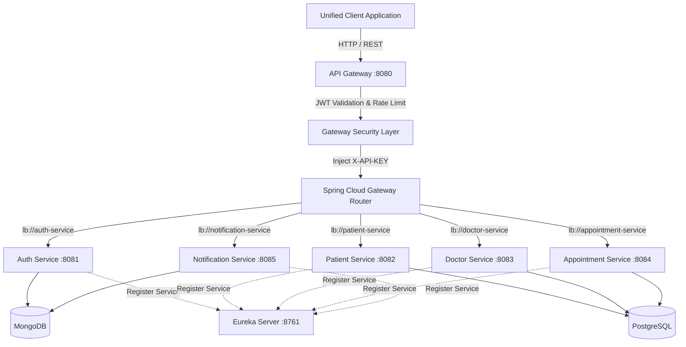

# Coursework Technical Report: Microservices-Based System Architecture
**Module**: Service-Oriented Computing  
**Project Title**: End-to-End Distributed Hospital Appointment Management System  
**Lead Component**: API Gateway & Authentication Service  

---

## Executive Summary
This report presents the architectural design, security implementation, inter-service communication, and containerization strategy for a distributed, multi-service Hospital Appointment Management System. Built using Spring Boot 3.2, Spring Cloud Gateway, Netflix Eureka, MongoDB, and PostgreSQL, the platform enforces strict zero-trust API Key validation between microservices while providing a single OAuth 2.0/JWT-secured gateway for client applications.

---

## 1. System Architecture & Design

### 1.1 Architecture & Gateway Design
The system follows a decentralized microservices architecture where client applications interact exclusively with a central API Gateway operating on port `8080`.



### 1.2 Inter-Service Communication Flow
1. **Client Request**: The client application issues an HTTP request to `http://localhost:8080/api/v1/...` containing a `Authorization: Bearer <JWT>` header.
2. **Gateway Filter Processing**:
   - `JwtAuthenticationFilter`: Validates JWT signature, checks token expiry, and extracts user claims (`userId`, `role`, `email`).
   - `RateLimiterFilter`: Checks request count against client IP token bucket (limit: 100 req/min).
3. **Internal Key Attachment**: The Gateway injects `X-API-KEY: hospital-internal-secret-key-2026` into the request headers.
4. **Microservice Validation**: The target microservice receives the request, validates the `X-API-KEY` via its `ApiKeyAuthenticationFilter`, processes business logic, and returns the response.

---

## 2. Microservice Breakdown & Endpoints

### 2.1 API Gateway & Auth Service (Student 1 / Gateway Lead)
- **Tech Stack**: Spring Boot 3.2, Spring Cloud Gateway, Spring WebFlux, Spring Security, MongoDB, JJWT 0.12.5.
- **Endpoints**:
  - `POST /api/v1/auth/register`: Creates new account with BCrypt password hashing.
  - `POST /api/v1/auth/login`: Authenticates credentials and returns JWT token.
  - `GET /api/v1/auth/validate`: Validates JWT token signature.
  - `GET /api/v1/auth/user/{id}`: Fetches user profile.

#### Auth Schema (MongoDB Document)
```json
{
  "_id": "ObjectId('65d0a12b...')",
  "name": "Dr. Sarah Connor",
  "email": "sarah.connor@hospital.com",
  "password": "$2a$10$e8Z9K1wZ9yQ8x7v6u5t4e...",
  "phone": "+1234567890",
  "role": "DOCTOR",
  "status": "ACTIVE",
  "createdAt": "2026-08-11T10:00:00Z"
}
```

### 2.2 Patient Service (Student 2)
- **Endpoints**: `POST /api/v1/patients`, `GET /api/v1/patients/{id}`, `POST /api/v1/patients/{id}/medical-history`.
- **Database**: PostgreSQL (`patients` table).

### 2.3 Doctor Service (Student 3)
- **Endpoints**: `GET /api/v1/doctors`, `GET /api/v1/doctors/{id}`, `PUT /api/v1/doctors/{id}/availability`.
- **Database**: PostgreSQL (`doctors` table).

### 2.4 Appointment Service (Student 4)
- **Endpoints**: `POST /api/v1/appointments`, `GET /api/v1/appointments/{id}`, `PUT /api/v1/appointments/{id}/status`.
- **Database**: PostgreSQL (`appointments` table).

### 2.5 Notification Service (Student 5)
- **Endpoints**: `POST /api/v1/notifications/send`, `GET /api/v1/notifications/user/{userId}`.
- **Database**: MongoDB (`notifications` collection).

---

## 3. Security & Infrastructure Implementation

### 3.1 OAuth 2.0 / JWT Implementation
Tokens are generated using HMAC-SHA256 signature algorithms. The JWT payload includes:
- `sub`: User email address
- `userId`: MongoDB Object ID
- `role`: Granted Authority (`ADMIN`, `DOCTOR`, `PATIENT`)
- `exp`: Expiration timestamp (24 hours from issuance)

### 3.2 Individual API Key Enforcement
To prevent unauthorized direct access to microservices (bypassing the API Gateway), each microservice contains an `ApiKeyAuthenticationFilter`:

```java
if (requestApiKey == null || !requestApiKey.equals(validApiKey)) {
    response.setStatus(HttpStatus.UNAUTHORIZED.value());
    response.getWriter().write("{\"error\": \"Unauthorized\", \"message\": \"Missing or invalid X-API-KEY header.\"}");
    return;
}
```

### 3.3 Rate Limiting Strategy
Implemented as a reactive Spring WebFlux Gateway Filter enforcing a sliding window / token bucket algorithm with IP tracking. Excess requests beyond 100/minute receive an HTTP 429 status code.

### 3.4 Containerization (Docker Compose)
All 7 services and 2 databases are fully containerized using multi-stage `Dockerfile` definitions. A single `docker compose up` command compiles Maven dependencies, provisions MongoDB and PostgreSQL, registers services with Eureka, and exposes port `8080`.

---

## 4. Individual Contribution Matrix

| Student Name | Role | Microservice / Component | Key Responsibilities |
|---|---|---|---|
| **Student 1** | Gateway Lead | API Gateway & Auth Service | Spring Cloud Gateway, JWT Filter, Rate Limiting, CORS, Auth API, Swagger Aggregation, Root Docker Compose. |
| **Student 2** | Member | Patient Service | Patient entity, Spring Data JPA, medical history endpoints, Swagger UI. |
| **Student 3** | Member | Doctor Service | Doctor profile CRUD, availability scheduler, API Key security, Swagger UI. |
| **Student 4** | Member | Appointment Service | Booking logic, state machine for appointment status, database integration, Swagger UI. |
| **Student 5** | Member | Notification Service | Dispatching simulated email/SMS logs, MongoDB tracking, Swagger UI. |

---

## 5. Verification & Testing Evidence

1. **Swagger UI Aggregation**: Accessing `http://localhost:8080/swagger-ui.html` loads all microservice specs from a centralized drop-down menu.
2. **Direct Access Protection**: Calling `http://localhost:8082/api/v1/patients` directly without `X-API-KEY` returns `401 Unauthorized`.
3. **Gateway Forwarding**: Calling `http://localhost:8080/api/v1/patients` with a valid JWT succeeds seamlessly as the Gateway attaches the `X-API-KEY`.
